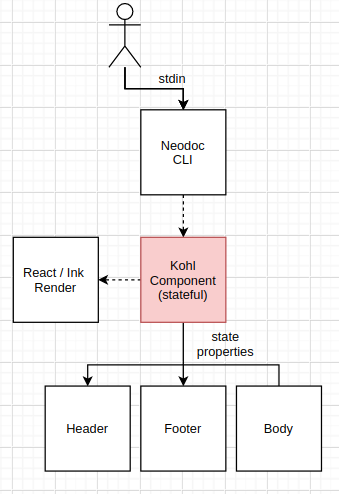
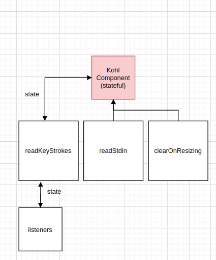

# kohl


kohl as in kohlrabi. The successor project to https://github.com/rgrannell1/kale.

## Stability Index

2, Evolving - This project is healthy, but might lack testing or documentation or it is prone to breaking changes

### Usage

```
kohl
```

kohl is built to help find important logs; for example:

```
kohl < /var/log/syslog

# or
cat /var/log/syslog | kohl
```

### Files


```
.github/workflows
  ci.yaml                    defines the CI workflow for testing this repo
.vscode
  launch.json                includes launch instructions for debugging
 dist                        compiled code, so people don't need to manually compile to test
 images/                     images used by the readme
 inkling/                    an experimental testing framework based on `ink-testing-framework`
 src/
   app/                      code app logic
     Line.ts                 class representing an input line of text
     LinesFilter.ts          filters and highlights collections of lines
     files.ts                defines file-loading and help files
     highlight-pattern.ts    defines a memoised line-highlighting function
     language.ts             defines a LL parser that parses commands provided to Kohl
     run-command.ts          executes Kohl commands and updates the application state accordingly

   cli/                      the neodoc cli definition for Kohl
   commons/                  shared utility code
   components/               React components defining the application state (`Kohl.tsx`) and application view (the rest)
   files/                    template files (Mustache) used by Kohl for help and other documentation
   keypress/                 a map of keypress predicate's to application state-changes. Handle's Kohl's keyboard input
   library/                  procedures available from Kohl's command-mode
   externals.d.ts            declarations for external modules that have no typing library
tests/
  Body/                      test body components
  Footer/                    test footer components
  Header/                    test header components
  Kohl/                      individual application tests
```

### Tests

Kohl tests each pure-component (most of them) by directly providing test-input and checking the rendered output is as expected. The application
itself is tested via [inkling](https://github.com/rgrannell1/inkling), a puppeteer-style testing library I wrote. Specifically, I tested:

- displaying entered command
- exits via `q` and `escape`
- ~~exits via `Ctrl + C`~~
- help document display
- help document exit
- ~~stdin reads~~

### Architecture





### Installation

On Linux distributions that support Snap packages, run:

```
sudo snap install kohl
```

### Build

#### Snapcraft

```zsh
snapcraft
sudo snap remove kohl
sudo snap install kohl_v0.1.0_amd64.snap --dangerous --devmode
cat data/apache_logs.txt | kohl
```

#### Performance

```zsh
npm run perf:clean
npm run perf:measure
npm run perf:show
```

### Changelog

### License

The MIT License

Copyright (c) 2020 Róisín Grannell

Permission is hereby granted, free of charge, to any person obtaining a copy of this software and associated documentation files (the "Software"), to deal in the Software without restriction, including without limitation the rights to use, copy, modify, merge, publish, distribute, sublicense, and/or sell copies of the Software, and to permit persons to whom the Software is furnished to do so, subject to the following conditions:

The above copyright notice and this permission notice shall be included in all copies or substantial portions of the Software.

THE SOFTWARE IS PROVIDED "AS IS", WITHOUT WARRANTY OF ANY KIND, EXPRESS OR IMPLIED, INCLUDING BUT NOT LIMITED TO THE WARRANTIES OF MERCHANTABILITY, FITNESS FOR A PARTICULAR PURPOSE AND NONINFRINGEMENT. IN NO EVENT SHALL THE AUTHORS OR COPYRIGHT HOLDERS BE LIABLE FOR ANY CLAIM, DAMAGES OR OTHER LIABILITY, WHETHER IN AN ACTION OF CONTRACT, TORT OR OTHERWISE, ARISING FROM, OUT OF OR IN CONNECTION WITH THE SOFTWARE OR THE USE OR OTHER DEALINGS IN THE SOFTWARE.
