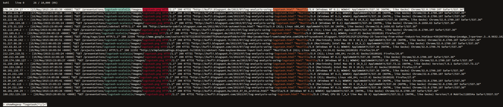

# kohl




kohl as in kohlrabi. The successor project to https://github.com/rgrannell1/kale.

## Stability Index

2, Evolving - This project is healthy, but might lack testing or documentation or it is prone to breaking changes

### Usage

```
kohl
```

kohl is built to help find important logs; for example:

```
kohl < /var/log/syslog

# or
cat /var/log/syslog | kohl
```

### Architecture


### Installation

On Linux distributions that support Snap packages, run:

```
sudo snap install kohl
```

### Build

#### Snapcraft

```zsh
snapcraft
sudo snap remove kohl
sudo snap install kohl_v0.1.0_amd64.snap --dangerous --devmode
cat data/apache_logs.txt | kohl
```

#### Performance

```zsh
npm run perf:clean
npm run perf:measure
npm run perf:show
```

### Changelog

### License

The MIT License

Copyright (c) 2020 Róisín Grannell

Permission is hereby granted, free of charge, to any person obtaining a copy of this software and associated documentation files (the "Software"), to deal in the Software without restriction, including without limitation the rights to use, copy, modify, merge, publish, distribute, sublicense, and/or sell copies of the Software, and to permit persons to whom the Software is furnished to do so, subject to the following conditions:

The above copyright notice and this permission notice shall be included in all copies or substantial portions of the Software.

THE SOFTWARE IS PROVIDED "AS IS", WITHOUT WARRANTY OF ANY KIND, EXPRESS OR IMPLIED, INCLUDING BUT NOT LIMITED TO THE WARRANTIES OF MERCHANTABILITY, FITNESS FOR A PARTICULAR PURPOSE AND NONINFRINGEMENT. IN NO EVENT SHALL THE AUTHORS OR COPYRIGHT HOLDERS BE LIABLE FOR ANY CLAIM, DAMAGES OR OTHER LIABILITY, WHETHER IN AN ACTION OF CONTRACT, TORT OR OTHERWISE, ARISING FROM, OUT OF OR IN CONNECTION WITH THE SOFTWARE OR THE USE OR OTHER DEALINGS IN THE SOFTWARE.
